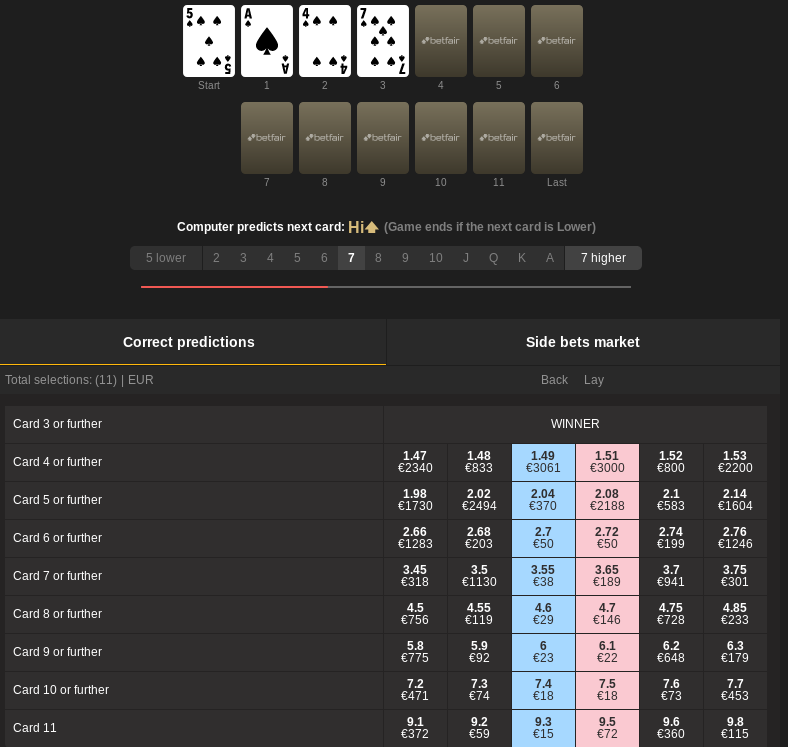
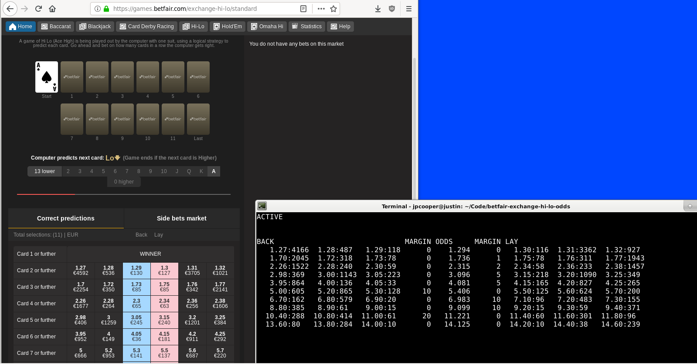

# Computing exact odds for Betfair's Exchange Hi Lo

In this document and repository I describe how to efficiently compute
exact odds for all outcomes in Betfair's [Exchange Hi
Lo](https://games.betfair.com/exchange-hi-lo/standard) in polynomial
time and space relative to the number of cards left in the deck. Say
good bye to Monte Carlo.

The polynomialness of the algorithm relies on a characterisation of
game states which greatly reduces the problem space from `n!`, where
`n` is the number of cards left in the deck.

The user can make bets on Betfair based on these computed odds and
guarantee income in the case that these bets are matched.

With the application `betfair-exe` contained in this repository, we
can follow the current game in play on Betfair in real time, compute
odds for each outcome and compare those odds with the odds provided by
the market.

An analysis using `betfair-exe` to compare the computed odds to the
odds available in the market and attempts at betting by hand lead us
to the conclusion that making money using this system is most probably
possible given an automated solution using the developers' API which
Betfair provides.

## Background

[Betfair](betfair.com)'s Exchange Hi Lo is a gambling card game played
with a single suit of 13 cards. If you're in a country where Betfair
is normally blocked, you might want to keep reading anyway. This is
because the game turned out to be quite interesting even though its
rules are so simple. A bit like, but not quite like, the game of Go.

You can see a game in progress and get a feel for it at
https://games.betfair.com/exchange-hi-lo/standard. Here is a picture
of a game in progress:



Conversely to the intractable nature of Go, I found that it is
possible to compute the odds of the outcomes available on Betfair to
bet on in polynomial time and space in relation to the number of cards
left in the deck.

This method came to me many years after first coming across the game.
I first tried a Monte Carlo solution, which was a good opportunity to
write some CUDA code for my GPU. I wasn't really satisfied with a
Monte Carlo solution, because it was inexact, and I always wondered
whether an exact solution was possible.

You might look at the game for a few minutes and think that this
method is blindingly obvious. In that case, you are most probably
smarter than me. Either way, what follows is a fun study in discrete
probability and its application towards potentially making money.

### The Algorithm

A detailed explanation of how the game works, how I calculate the odds
of the various outcomes, and how I implement this can be seen in
[prob.c](c/prob.c).

The key realisation leading to the polynomialness of the algorithm
embodied in [prob.c](c/prob.c) is that a game state need not be
characterised by the cards in the deck plus the last card played. That
leads to a factorial problem space.

It suffices to characterise game states purely by the _number_ of
cards left in the deck and the _number_ of cards that are lower than
the last card played.

### Later on

I continue with a light explanation of the game and its rules (more
information in [prob.c](c/prob.c)). Please check it out. I spent a lot
of time writing an exact explanation of how things work in the
comments.

## The Game

Exchange Hi Lo is played with 13 cards from a single suit. Ace is
high. The betting in Exchange Hi Lo differs from that of normal Hi Lo,
but the games proceed similarly.

The game is played over a sequence of rounds, with one card being
dealt without replacement in each round. The player bets on the
outcome of each dealt card in relation to the card dealt previously.

In normal Hi Lo, the player bets on whether the next card will be
higher or lower than the last played card. In Betfair's Exchange Hi
Lo, it is the computer that does the prediction of the next card.

The computer predicts the next card according to the following
heuristic: If there are equally many or more cards left in the deck
that are higher compared to the last dealt card than there are those
that are lower, then bet that the next dealt card will be
higher. Otherwise bet that it will be lower. Given this heuristic,
your task is to bet on how long you think the computer will be right.

I include below the same image of the game in progress from
above. Take a look.


The rounds are named in the game as follows: Start, 1, 2, ..., 11,
Last. We are in round 3 and four cards have been dealt, including the
card for this round. This is card the 7 of spades, which turned out to
be a winning card. That is, the computer predicted correctly. Why is
this?

Go back in time to the end of round 2. There were 10 cards left. The
last dealt card was the 4 of spades. There are two cards remaining in
the deck that are lower than the last played card, namely the 2 and 3
of spades. There are 8 cards remaining in the deck that are higher
than the last played card.

Therefore at round 3, before dealing the card, the computer predicts
that the next dealt card will be higher. The card dealt at round 3,
the 7 of spades, is higher than the previously dealt card, the 4 of
spades. Therefore the computer predicted correctly and it wins that
round.

Note that in the image, below where the cards are dealt, the number of
cards in the deck that are higher and lower than the last dealt card,
the 7 of spades, is shown. But here, the numbers of higher and lower
cards are always calculated based on the whole deck of 13 minus the
card just dealt, and not just the cards remaining after dealing the
cards on the table.

It is actually on the cards _remaining_ in the deck that the computer
makes its prediction. Please do not let this confuse you. It is not
immediately obvious to me how displaying this information is useful to
anyone. Maybe someone can tell me (contact details at the bottom).

## Betting on the Game

Look at the bottom of the image above to where the outcomes available
to bet on are displayed. The outcome "Card 3 or further" has just
won. If you backed this bet previously, you will have won some
money. If you now bet on, say, "Card 8 or further", the computer will
have to predict correctly at least until round 8.

The outcomes "Card 4 or further" and further are still available to
bet on. A market is displayed outlining the available odds to to both
back and lay outcomes, along with the amount of unmatched money
available to back and lay at given decimal odds.

Revise your understanding of [decimal
odds](https://www.timeform.com/betting/basics/understanding-decimal-odds)
at the link to the left. It helps to understand that to break even
with given decimal odds for backing a certain outcome at given odds,
the probability of that outcome must be the inverse of the given
odds. This is where knowing the exact probability of an outcome comes
in handy. Backing at odds greater than the real odds will guarantee
income in the long-run. Knowing exact odds is not common in the
betting world, for instance in poker or horse racing.

To back means to bet that an outcome will occur. To lay a bet means to
bet that an outcome won't occur. Laying is typically done by a
bookmaker who has computed the odds of all outcomes, and lays each
outcome. The bookmaker creates the market, and anyone can be a
bookmaker on Betfair. If you can back at odds higher than the true
odds, or lay at odds less than the true odds, then you are in the
money. Buy low, sell high.

## Computing the Odds and Putting them to Use

There are 13! = 6227020800 ways to shuffle 13 cards. This seems to
imply that it would be quite difficult to calculate the odds for the
outcomes in Exchange Hi Lo. Maybe it is possible to brute force the
calculation of the odds these days in a time that is relevant to
making money on Betfair. I haven't checked, and I now do not need to.

The key realisation is that the tree of possible game states can be
partitioned according to a characterisation of game states based only
on how many cards are left in the deck and how many of those cards are
lower than the last card played.

This characterisation greatly reduces the problem space, and allows us
to apply a dynamic algorithm to compute the odds in polynomial time
and space relative to the number of cards left in the deck. As I said,
the full explanation is in [prob.c](c/prob.c). I hope the explanation
and implementation make sense, do not contain bugs and are
sufficient. Email me if not (details in profile).

Without diving any further into the workings of this algorithm, let's
instead look at its potential application towards making money on
Betfair.

Have a look at the image below of a game in process, plus the output
of a curses application I wrote in Haskell which every second
downloads the [current game state and betting
market](https://api.games.betfair.com/rest/v1/channels/1444093/snapshot?selectionsType=CorrectPredictions),
plugs it into [prob.c](c/prob.c) and displays the exact odds it
calculates in relation to the odds available in the market.

Haskell turned out to be quite nice for creating a system to download
the current game state, parsing the XML, extracting the relevant
information and parsing it, and then formatting it for display.

I wrote `prob.c` in C, because I thought that it was best suited for
writing a simple dynamic algorithm involving lots of array updates. I
could have used Haskell's ST monad, but I'm not sure that the solution
would be any more elegant. I could have also used a traditional
Haskell solution involving copying updates, but that solution wouldn't
look too much different to the ST Monad solution anyway. Haskell has a
C FFI that isn't too difficult to use, so why not?

I am also convinced that speed is the only way to make money with this
game, for reasons that will become apparent later, so C could turn out
to be the better initial solution in this regard.

You can run this application by first [installing
stack](https://docs.haskellstack.org/en/stable/install_and_upgrade/). And
then running the following commands:

```
stack update
stack build
stack exec betfair-exe
```

Take a look at the implementation of the `betfair-exe` application in
the [betfair-exe](app/betfair-exe) directory. Maybe start with
[Main.hs](app/betfair-exe/Main.hs).

Make sure your terminal size is large enough for the application to
work. The application will tell you if it is not large enough. The
minimum terminal size needed is not deterministic, but I have not
found this to be enough of a problem to rectify.



Look at the market information available in the browser, there is a
"back" side and a "lay" side. The odds in blue and those to the left
are the unmatched lay bets which can be backed. The odds in red and
those to the right are the unmatched back bets which can be laid.

If you _back_ an outcome at given odds, then you bet that the outcome
occurs, and you stand to receive your initial stake multiplied by
those odds if the outcome does occur, otherwise you lose that stake.

If you _lay_ an outcome at given odds, then you bet that the outcome
_does not_ occur, and you stand to pay out the stake multiplied by the
odds if the outcome _does_ occur. If the outcome does not occur, then
you receive the stake (not multiplied by the odds). Laying makes sense
for bookmakers who provide odds for backing over all outcomes. It is
not something that the typical punter does. However, laying outcomes
would make sense with this system.

Look at the market for outcome "Card 2 or further". There are 130
Euros available to back at odds of 1.29. This line displays the top
three odds available either to back or lay this outcome, and how much
money is available to back or lay at those odds. This corresponds to
the first line of information displayed by the application, beginning
with the substring "1.127".

The application displays amounts of money in GBP and not Euros. The
"1.127:118" in the LAY column means that there are 118 unmatched GBP
available to lay at odds of 1.127 for the outcomes "Card 2 or
further". 118 pounds were equal to 130 Euros as displayed in the
browser at the time of writing. I haven't yet figured out how to make
the API use Euros for the currency, as I don't think the amount of
unmatched money is particularly important to know right now.

Note the ODDS column and the two MARGIN columns surrounding it. The
market for the outcome "Card 2 or futher" is tight. The margin on both
sides is 0.

The margin is defined as follows:

1. The minimum odds increment is defined as follows: Odds in a given
   range must be a whole multiple of the minimum increment for that
   range. For instance, odds between 1.01 and 2 have increment
   0.01. Odds of 1.55 are valid, but odds of 1.555 are not. Odds
   between 3 and 5 have increment 0.02. That means that odds of 3.02
   are valid, but odds of 3.01 are not. The increments are defined by
   the API.
2. The minimum profitable back odds are the minimum odds greater than
   the real odds which conform to the corresponding minimum odds
   increment.
3. The maximum profitable lay odds are the maximum odds less than the
   real odds which conform to the corresponding minimum odds
   increment.
4. The margin between two numbers is the number of pips (hundredths)
   between them.
5. The back margin is the difference between the minimum profitable
   back odds and the minimum unmatched back odds in the LAY column.
6. The lay margin is the difference between the maximum profitable lay
   odds and the maximum unmatched lay odds in the BACK column.

I know from my own experience that it is confusing that unmatched back
requests occur in the LAY column, and that unmatched lay requests
occur in the BACK column. By carrying out a back bet in the BACK
column, you match an unmatched lay request. By carrying out a lay bet
in the LAY column, you lay an unmatched back request.

The real odds that we have calculated for "Card 2 or further" are
1.294, and the maximum unmatched lay odds to back are 1.29, with 130
Euros available to match. These are the maximum odds at which laying
would be profitable. Similarly, the minimum unmatched back odds to lay
are 1.30, with 127 Euros available to match. These are the minimum
odds at which backing would be profitable. Hence margins of 0 on both
sides.

The situation for "Card 5 or further" is different. The real odds that
we have calculated for that outcome are 3.096. There are 240 Euros to
lay at odds of 3.15. However, with a margin of 5 to the unmatched back
odds of 3.15, we can back at 3.10 and still make a profit over the
real odds of 3.096.

Similar profits are to be made for backing outcomes further down in
the table, where there are two cases of positive margins to back.

## Conclusion

We can see from the output of `betfair-exe` that a large number of
money is being bet at odds with margins further from the true odds
than need be. This shows the potential to undercut the odds provided
while still maintaining a good margin.

Betting on outcomes with a margin over the real odds must provide
positive returns in the long-run, and assuming that we are calculating
the odds correctly, this should show the potential for making money
with this system. I have not carried out a formal proof of the odds
calculation algorithm, but empirically, comparing it to the odds of
the unmatched bets in the market leads me to think that it is correct.

I tried to make some money with this by betting by hand. With maximum
stakes of 25 Euros, I tried to make back bets where the the minimum
existing unmatched back bet was above what was needed to still make a
profit, thus undercutting the unmatched back bets in each case with a
cheaper bet while still maintaining an expected profit.

I expected some of these bets to go through, but none did. I didn't
lose any money, but sadly I did not win any either. On further
thought, this outcome makes complete sense.

Analysing the odds of the unmatched bets and my experience, I can make
the following hypotheses and conclusions:

1. The existence of unmatched bets at odds further from the real odds
   than needed does not mean that bets at odds as close as possible to
   the real odds while maintaing a positive expected profit are not
   actually matched.
2. Given that no one is matching my cheaper back bets that are made
   within time possible for a human to input them, the only entities
   laying in this game are probably computers. This is an obvious
   conclusion.
3. All trades are probably happening within the first few
   milliseconds, and the entities who are laying the outcomes are
   making no further lays to match subsequent backs.
4. Any computer playing this game most probably has access to an
   equivalent way of computing exact odds for this game.
5. However, this leaves the following final question: Assuming that no
   human can calculate the odds for this game according to the
   algorithm in `prob.c` and that no simpler algorithm exists such
   that he could, why are bets (which are unmatched) being made at
   odds further from the real odds than need be? Is this just the
   computers opening some bets in the hope that a human, having
   something to click on, will bite?
6. This game is only worth playing as a computer with access to the
   developers' API.
7. Given point 6., the winner is probably the fastest person to
   compute the odds and get bets based on those odds to Betfair's
   servers. This is where having a polynomial time and space method of
   computing the odds comes in handy.